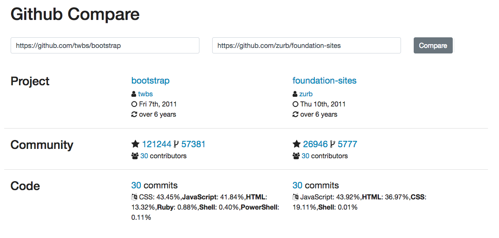

## COMPARADOR DE GITHUB

A prova será baseada na figura a seguir para propor uma comparação de repositórios do github:

Para isso será necessário usar a [API Rest do Github](https://developer.github.com/v3/), usando especificamente as rotas:

- https://api.github.com/repos/:owner/:repo
- https://api.github.com/repos/:owner/:repo/languages
- https://api.github.com/repos/:owner/:repo/contributors
- https://api.github.com/repos/:owner/:repo/commits

> [Alternativa de resposta](site-response/)
