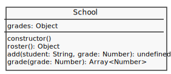
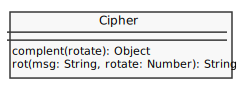
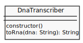

# DESAFIO

## DESCRIÇÃO
---

O desafio é composto por quarto questões disponibilizados no arquivo [code.zip](code.zip). Cada arquivo possui uma Suite de Testes que apresenta a sua respectiva validação por meio de testes.

Contudo, para executar cada cenários de validação da Suite de Teste será necessário instalar a ferramenta [Jest](https://facebook.github.io/jest/) usando o `npm` e o `package.json` por meio do comando:

```
$ cd nome-aluno-matricula
$ npm install
```

Também se certifique se a versão do `node` está atualizado:

```
$ node -v
```

Após a instalação do `Jest`, é preciso verificar se tudo ocorreu perfeitamente. Então, por uma questão de verificação, digite o seguinte comando para executar da Suite de Testes da *Questão 1*:

```
$ npm run test triangle/triangle.test.js
```

Se a resolução do problema ainda não foi inicializada e o `Jest` funcionou corretamente, então esse comando deverá exibir algo como:

```
$ npm run test triangle/triangle.test.js

> desafio-ecma@1.0.0 test /Users/.../simulado-ecma
> ./node_modules/jest/bin/jest.js "triangle/triangle.test.js"

 FAIL  triangle/triangle.test.js
  ● Triangle › equilateral triangles have equal sides

    TypeError: triangle.kind is not a function

      at Object.<anonymous> (triangle/triangle.test.js:7:21)
          at Promise (<anonymous>)
      at Promise.resolve.then.el (node_modules/p-map/index.js:46:16)
          at <anonymous>

  Triangle
    ✕ equilateral triangles have equal sides (3ms)
    ○ skipped 10 tests

Test Suites: 1 failed, 1 total
Tests:       1 failed, 10 skipped, 11 total
Snapshots:   0 total
Time:        1.291s
Ran all test suites matching "triangle/triangle.test.js".
```

Ou seja, no total de 11 testes foi executado apenas 1, que mesmo assim não está se comportanto conforme esperado. 

Contudo, ao concluir a implementação corretamente o mesmo comando deverá exibir:

```
$ npm run test triangle/triangle.test.js

> desafio-ecma@1.0.0 test /Users/.../simulado-ecma
> ./node_modules/jest/bin/jest.js "triangle/triangle.test.js"

 PASS  code-response/triangle/triangle.test.js
  Triangle
    ✓ equilateral triangles have equal sides (4ms)
    ✓ larger equilateral triangles also have equal sides (1ms)
    ✓ isosceles triangles have last two sides equal
    ✓ isosceles triangles have first two sides equal (1ms)
    ✓ isosceles trianges have first and last sides equal
    ✓ isosceles triangles have two first sides equal
    ✓ isosceles triangles have in fact exactly two sides equal
    ✓ scalene triangles have no equal sides
    ✓ scalene triangles have no equal sides at a larger scale too (1ms)
    ✓ scalene triangles have no equal sides in descending order either
    ✓ very small triangles are legal

Test Suites: 1 passed, 1 total
Tests:       11 passed, 11 total
Snapshots:   0 total
Time:        1.203s
Ran all test suites matching "triangle/triangle.test.js".
```

O que significa que todos os cenários listados funcionam conforme descrito na Suite de Teste.

> **Observação**: É importante destacar que os arquivos de teste fazem parte de um estratégia de otimização e automatização da validação das entradas e saídas de cada problema. Mas, nada impede que esse processo seja realizado manualmente.

Por fim, é importante destacar que cada questão irá detalhar um teste específico, por exemplo, na *QUESTÃO 1* alguns cenários de testes são descritos no arquivo `triangle/triangle.test.js` do problema que deve ser codificado no arquivo `triangle/triangle.js`.

### QUESTÕES
---

**QUESTÃO 1** - O conjunto de três retas podem formar um triângulo que é classificado em função da quantidade de retas de tamanho igual. Se o triângulo possui todas, duas ou nenhuma reta igual, ele será classificado respectivamente como sendo `equilateral`, `isosceles` e `scalene`.

Para facilitar essa identificação crie um objeto `Triangle` no arquivo [`triangle/triangle.js`](triangle/triangle.js) que recebe em sua construção os tamanhos das três retas, e ao chamar o método `kind()` deve-se retornar o seu tipo por meio de uma `string`:


conforme ilustra o código a seguir:

```js
let triangle = new Triangle(2, 2, 2)
console.log(triangle.kind()) //=> equilateral
```

```js
let triangle = new Triangle(2, 2, 1)
console.log(triangle.kind()) //=> isosceles
```

```js
let triangle = new Triangle(3, 2, 1)
console.log(triangle.kind()) //=> scalene
```

Detalhe, algumas outras condições de retorno estão previstas na Suite de Teste [`triangle/triangle.test.js`](triangle/triangle.test.js).
<br><br>

**QUESTÃO 2** - O Sistema de controle acadêmico de uma instituição educacional possui um problema para geração das médias de suas turmas, o que acarreta em um esforço sobrenatural dos professores para gerar essa métrica, pois depende do fornecimento das notas de cada aluno para o cálculo final da média.

Por meio de vários contatos, os professores souberam que os alunos do IFPB poderiam resolver esse problema de modo super fácil, então, inevitavelmente a instituição foi em busca de tais profissionais.

A princícpio uma equipe planejou a criação de um Sistema Web para tal problema, que deveria possuir um objeto chamado `School` no arquivo [grade-school/grade-school.js](grade-school/grade-school.js). O objeto possuirá duas ações, a `roster()` e `grade()`, que respectivamente devem gerar a lista de notas por lista nomes ordenado dos alunos, e a lista dos nomes dos alunos de uma nota específica:



Com a ajuda da instituição foi possível esboçar alguns casos de teste para validar os possíveis comporatamentos do objeto `School`:

```js
let school = new School()

console.log(school.roster()) //=> {}
```

```js
let school = new School()

school.add('Aimee', 2)

console.log(school.roster()) //=> { 2 : [ 'Aimee' ] }
```

```js
let school = new School()

school.add('Blair',2)
school.add('James',2)
school.add('Paul',2)

console.log(school.roster()) //=> { 2 : [ 'Blair', 'James', 'Paul' ] }
```

```js
let school = new School()

school.add('Franklin',5)
school.add('Bradley',5)
school.add('Jeff',1)

console.log(school.roster()) //=> { 1: ['Jeff'], 5: [ 'Bradley', 'Franklin' ] }
```

```js
let school = new School()

school.add('Franklin',5)
school.add('Bradley',5)
school.add('Jeff',1)

console.log(school.grade(5)) //=> [ 'Bradley', 'Franklin' ]
```

```js
let school = new School()

console.log(school.grade(1) //=> []
```
<br><br>

**QUESTÃO 3** - A [Criptografia](https://en.wikipedia.org/wiki/Cryptography) é considerada uma importante área da computação, mesmo possuindo muitas novidades recentes, é possível encontrar vários fatos que demonstram que sua origem é antiga.

Um exemplo disso seria a própria [Cifra de César](https://www.youtube.com/watch?v=jhXCTbFnK8o), considerada uma técnica de criptografia de substituição, com origem no Império Romano, e que recebeu este nome em uma homenagem à Júlio César devido ao seu uso em correspondências militares.

"A ação de uma Cifra de César é mover cada letra do alfabeto um número de vezes fixo abaixo no alfabeto. Este exemplo está com uma troca de três, então o B no texto normal se torna E no texto cifrado." [Wikipedia, 2017](https://pt.wikipedia.org/wiki/Cifra_de_César)

[](https://pt.wikipedia.org/wiki/Cifra_de_César)<br>
*Fonte: [Wikipedia, 2017](https://pt.wikipedia.org/wiki/Cifra_de_César)*

O número de deslocamentos também pode definir uma segunda nomenclatura para essa criptografia, por exemplo, a cifra anterior também é conhecida por ROT3, por se tratar de um rotacionamento de 3 letras do alfabeto, então, por consequência, o ROT13 iria rotacionar 13 letras, fazendo que a letra A seja substituída por N.

Para ajudar nesse processo foi fornecido o arquivo 
[`cipher/cipher.js`](cipher/cipher.js) que possui a função `rot`, e o [`cipher/cipher.test.js`](cipher/cipher.test.js) que define alguns casos de teste de `rot`:



Por exemplo:

```js
const cipher = new Cipher()

cipher.rot('abc', 2)  //=> cde
cipher.rot('abc', 13) //=> nop
```

Pensando nisso, o professor da disciplina de LS resolveu usar esta cifra com um propósito mais pacífico, e resolveu divulgar o seguinte texto no Slack da disciplina com ROT13 no intuito de ver a reação da turma ao ler a mensagem descriptografada:

```
Dhny é n áeiber cersrevqn qr hz nqzvavfgenqbe qr erqrf? Vcê.
Dhny é b qvgb cbchyne znvf hfnqb cbe hz nanyvfgn qr erqrf? Pnvh an erqr, é cuvfuvat!
```

Detalhe, para decifrar uma mensagem em ROT3 basta usar o ROT 23, ou seja:

```
rot(mensagem, rotCifra) = mensagemCriptada
rot(mensagemCriptada, rotDecifra) = mensagem

Onde rotDecifra = 26 - rotCifra 
```
<br><br>

**QUESTÃO 4** - Segundo o [Só Biologia](http://www.sobiologia.com.br/conteudos/Citologia2/AcNucleico5.php) a "Síntese de RNA (mensageiro, por exemplo) se inicia com a separação das duas fitas de DNA. Apenas uma das fitas do DNA serve de molde para a produção da molécula de RNAm. A outra fita não é transcrita. Essa é uma das diferenças entre a duplicação do DNA e a produção do RNA.".

<br>
*Fonte: [Só Biologia](http://www.sobiologia.com.br/conteudos/Citologia2/AcNucleico5.php)*

Essa síntese estava sendo analisada em um centro de genética, através de equipamento que geraram a cadeia de DNA e RNA de modo textual. 

Pensando em automatizar funturos mapeamentos de mutação, foi solicitado a criação de um programa que pudesse gerar de modo mais rápido a sequência de RNA a partir de um DNA.

Imaginando um segmento hipotético de um filamento de DNA com a seqüência de bases:

> DNA - ATGCCGAAATTTGCG

O segmento de RNA formado na transcrição terá a seqüência de bases:

> RNA - UACGGCUUUAAACGC 

Ou seja, o processo consiste basicamente na conversão:

|DNA|RNA|
| - | - |
| G | C |
| C | G |
| T | A |
| A | U |

Então, tente criar um script [rna-transcription/rna-transcription.js](rna-transcription/rna-transcription.js) que gere essa conversão, e para efeitos de validação use a Suite de Teste [rna-transcription/rna-transcription.test.js](rna-transcription/rna-transcription.test.js), por exemplo:

```js
const dnaTranscriber = new DnaTranscriber()
dnaTranscriber.toRna('C')) //=> G
dnaTranscriber.toRna('G')) //=> C
dnaTranscriber.toRna('A')) //=> U
dnaTranscriber.toRna('T')) //=> A
dnaTranscriber.toRna('ACGTGGTCTTAA')) //=> UGCACCAGAAUU
```



<br>
<br>
<br>

> Alternativa de resposta: [`triangle/triangle.js`](code-response/triangle/triangle.js), [`grade-school/grade-school.js`](code-response/grade-school/grade-school.js), [`rna-transcription/rna-transcription.js`](code-response/rna-transcription/rna-transcription.js) e [`cipher/cipher.js`](code-response/cipher/cipher.js).

<!-- 
https://pt.wikipedia.org/wiki/Transcrição_(genética)
http://www.sobiologia.com.br/conteudos/Citologia2/AcNucleico5.php
https://pt.khanacademy.org/science/biology/gene-expression-central-dogma/transcription-of-dna-into-rna/a/stages-of-transcription
http://exercism.io/exercises/php/rna-transcription/readme
 -->
