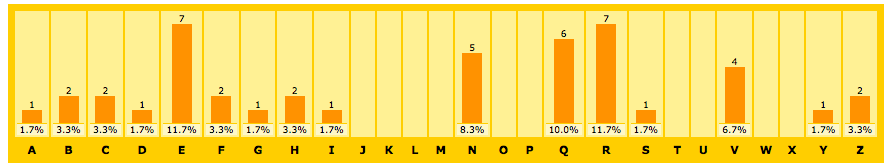

# DESAFIO

## DESAFIOS DE SEGURANÇA
---

Esta atividade é composta por quarto desafios localizados em arquivos [deste diretório compactado](code.zip). Cada arquivo possui uma Suite de Testes que apresenta a sua respectiva validação por meio de testes.

Contudo, para executar cada cenários de validação da Suite de Teste será necessário instalar a ferramenta [Jest](https://facebook.github.io/jest/) usando o `npm` e o `package.json` por meio do comando:

```
$ cd nome-aluno-matricula
$ npm install
```

Também se certifique se a versão do `node` está atualizado:

```
$ node -v
```

Após a instalação do `Jest`, é preciso verificar se tudo ocorreu perfeitamente. Então, por uma questão de verificação, digite o seguinte comando para executar da Suite de Testes da *Questão 1*:

```
$ npm run test cipher/cipher.test.js
```

Se a resolução do problema ainda não foi inicializada e o `Jest` funcionou corretamente, então esse comando deverá exibir algo como:

```
$ npm run test cipher/cipher.test.js
 FAIL  cipher/cipher.test.js
  Cipher
    ✕ decripting text with rot13 (10ms)
    ○ skipped 1 test

  ● Cipher › decripting text with rot13

    expect(received).toEqual(expected)
    
    Expected value to equal:
      {"rot1": "Eioz é o áfjcfs dfstsfwro rs ia orawbwghforcf rs fsrsg? Wdê.", ...}
    Received:
      undefined
    
    Difference:
    
      Comparing two different types of values. Expected object but received undefined.
      
      at Object.<anonymous> (cipher/cipher.test.js:41:37)
          at Promise (<anonymous>)
          at <anonymous>
      at process._tickCallback (internal/process/next_tick.js:188:7)

Test Suites: 1 failed, 1 total
Tests:       1 failed, 1 skipped, 2 total
Snapshots:   0 total
Time:        1.151s
Ran all test suites matching /cipher\/cipher.test.js/i.
```

Ou seja, no total de 2 testes foi executado apenas 1, que mesmo assim não está se comportanto conforme esperado. 

Contudo, ao concluir a implementação corretamente o mesmo comando deverá exibir:

```
$ npm run test cipher/cipher.test.js
 PASS  cipher/cipher.test.js
  Cipher
    ✓ decripting text with rot13 (7ms)
    ✓ dcripting text with rot7 (4ms)

Test Suites: 1 passed, 1 total
Tests:       2 passed, 2 total
Snapshots:   0 total
Time:        1.228s
Ran all test suites matching /cipher\/cipher.test.js/i.
```

O que significa que todos os cenários listados funcionam conforme descrito na Suite de Teste.

> **Observação**: É importante destacar que os arquivos de teste fazem parte de uma estratégia de otimização e automatização da validação das entradas e saídas de cada problema. Mas, nada impede que esse processo seja realizado manualmente.

Por fim, é importante destacar que cada questão irá detalhar um teste específico, por exemplo, na *QUESTÃO 1* alguns cenários de testes são descritos no arquivo `cipher/cipher.test.js` do problema que deve ser codificado no arquivo `cipher/cipher.js`.

### QUESTÕES
---

**QUESTÃO 1** - Na área da segurança da informação existe um ramo chamado de [Análise de Criptografia](https://en.wikipedia.org/wiki/Cryptanalysis), que consiste em uma séria de técnicas que podem ser utilizadas para desvendar uma mensagem criptografada. 

Segundo o portal [Cryptool](http://cryptool-online.de/index.php?option=com_content&view=article&id=55&Itemid=53&lang=en) existe algumas estratégias que podem ser utilizadas para analisar uma mensagem criptografada. Na maioria das vezes, o esforço e complexidade das técnicas vai depender da criptografia utilizada. Por exemplo, no filme [O Jogo da Imitação](https://pt.wikipedia.org/wiki/O_Jogo_da_Imitação) é possível ver o quão complexo foi para o matemático Alan Turing decodificar a máquina Enigma, usada pela Alemanha Nazista para tornar suas mensagens incompreensíveis em caso de interceptação pelo inimigo.

Contudo, existem criptografias mais simples que podem ser decodificados com técnicas mais fáceis. Para ilustrar, considere a Análise de Criptografia de Cifra de César através da seguinte mensagem:

> Dhny é n áeiber cersrevqn qr hz nqzvavfgenqbe qr erqrf? Vcê.

O próprio padrão da análise de frequências das letras já pode indicar que existe a possibilidade de uso de algum algoritmo de substituição, como a Cifra de César, mas ao se observar a mensagem não fica claro apontar qual foi a substituição específica.

Então, uma forma de decodificar a mensagem poderia ser tentando "rotacionar" a mensagem de **ROT1** até **ROT25**, para que visualmente identificar se alguma mensagem ficou legível.

Com isso, ao usar a classe `Cipher` do arquivo [cipher/cipher.js](code/cipher/cipher.js)


Pode-se usar o método `allRots()` para gerar esse resultado:

```js
let cipher = new Cipher()
let message = 'Dhny é n áeiber cersrevqn qr hz nqzvavfgenqbe qr erqrf? Vcê.'

console.log(cipher.allRots(message))
//=>
// {
//   rot1: 'Eioz é o áfjcfs dfstsfwro rs ia orawbwghforcf rs fsrsg? Wdê.',
//   rot2: 'Fjpa é p ágkdgt egtutgxsp st jb psbxcxhigpsdg st gtsth? Xeê.',
//   rot3: 'Gkqb é q áhlehu fhuvuhytq tu kc qtcydyijhqteh tu hutui? Yfê.',
//   rot4: 'Hlrc é r áimfiv givwvizur uv ld rudzezjkirufi uv ivuvj? Zgê.',
//   rot5: 'Imsd é s ájngjw hjwxwjavs vw me sveafakljsvgj vw jwvwk? Ahê.',
//   rot6: 'Jnte é t ákohkx ikxyxkbwt wx nf twfbgblmktwhk wx kxwxl? Biê.',
//   rot7: 'Kouf é u álpily jlyzylcxu xy og uxgchcmnluxil xy lyxym? Cjê.',
//   rot8: 'Lpvg é v ámqjmz kmzazmdyv yz ph vyhdidnomvyjm yz mzyzn? Dkê.',
//   rot9: 'Mqwh é w ánrkna lnabanezw za qi wziejeopnwzkn za nazao? Elê.',
//   rot10: 'Nrxi é x áoslob mobcbofax ab rj xajfkfpqoxalo ab obabp? Fmê.',
//   rot11: 'Osyj é y áptmpc npcdcpgby bc sk ybkglgqrpybmp bc pcbcq? Gnê.',
//   rot12: 'Ptzk é z áqunqd oqdedqhcz cd tl zclhmhrsqzcnq cd qdcdr? Hoê.',
//   rot13: 'Qual é a árvore preferida de um administrador de redes? Ipê.',
//   rot14: 'Rvbm é b áswpsf qsfgfsjeb ef vn benjojtusbeps ef sfeft? Jqê.',
//   rot15: 'Swcn é c átxqtg rtghgtkfc fg wo cfokpkuvtcfqt fg tgfgu? Krê.',
//   rot16: 'Txdo é d áuyruh suhihulgd gh xp dgplqlvwudgru gh uhghv? Lsê.',
//   rot17: 'Uyep é e ávzsvi tvijivmhe hi yq ehqmrmwxvehsv hi vihiw? Mtê.',
//   rot18: 'Vzfq é f áwatwj uwjkjwnif ij zr firnsnxywfitw ij wjijx? Nuê.',
//   rot19: 'Wagr é g áxbuxk vxklkxojg jk as gjsotoyzxgjux jk xkjky? Ovê.',
//   rot20: 'Xbhs é h áycvyl wylmlypkh kl bt hktpupzayhkvy kl ylklz? Pwê.',
//   rot21: 'Ycit é i ázdwzm xzmnmzqli lm cu iluqvqabzilwz lm zmlma? Qxê.',
//   rot22: 'Zdju é j áaexan yanonarmj mn dv jmvrwrbcajmxa mn anmnb? Ryê.',
//   rot23: 'Aekv é k ábfybo zbopobsnk no ew knwsxscdbknyb no bonoc? Szê.',
//   rot24: 'Bflw é l ácgzcp acpqpctol op fx loxtytdeclozc op cpopd? Taê.',
//   rot25: 'Cgmx é m ádhadq bdqrqdupm pq gy mpyuzuefdmpad pq dqpqe? Ubê.'
// }
```

Veja agora que fica viável analisar a mensagem criptografada, pois ela está legível no [**ROT13**](http://www.rot13.com), ou seja, se 13 rotações foram usadas para compreender, significa que originalmente foi usado um **ROT13** (26 - 13 rot = 13 rot) para criptografar a mensagem original. 

Portanto, use a Suite de Teste [cipher/cipher.test.js](code/cipher/cipher.test.js) para gerar a implementação de `allRots()`.

**QUESTÃO 2** - A [Análise de Frequência](https://en.wikipedia.org/wiki/Frequency_analysis) é uma ferramenta importante na Análise de Criptografia. Sua essência consiste em uma simples análise de quantas letras existem em uma mensagem.

Essa ferramenta pode ser importante na Análise de Criptografia porque a frequência das letras em um idioma possui um certo padrão, por exemplo, segundo o portal [Cryptool](http://cryptool-online.de/index.php?option=com_content&view=article&id=96&Itemid=117&lang=en) a letra de mais alta frequência no inglês é o `e` seguido do `t`, com frequências aproximadas de 12,7% e 9,1% respectivamente.

Tal informação pode ser útil nos algoritmos de substituição, pois a identificação da frequência na mensagem cifrada pode sugerir como foi realizada a substituição, ou seja, se na mensagem criptografada, escrito originalmente em inglês, a palavra de maior frequência for `h`, isso pode indicar que o **ROT3** foi usado, que seria a distância de `e` para `h`.

Visualmente a análise de frequência da seguinte mensagem:

> Dhny é n áeiber cersrevqn qr hz nqzvavfgenqbe qr erqrf? Vcê.

Pode ser gerada usando ferramentas como o [counton.org](http://www.counton.org/explorer/codebreaking/frequency-analysis.php):



Mas por uma questão de autonomia, vamos criar a classe `WordFrequency` para gerar essa estatística no arquivo [word-frequency/word-frequency.js](code/word-frequency/word-frequency.js):


Essa estatística seria criada especificamente pelo método `WordFrequency.frequency()`:

```js
let text = 'Dhny é n áeiber cersrevqn qr hz nqzvavfgenqbe qr erqrf? Vcê.'
console.log(WordFrequency.frequency(text))
//=>
// {
//   '1': ['.', '?', 'a', 'd', 'g', 'i', 's', 'y', 'á', 'é', 'ê'],
//   '2': ['b', 'c', 'f', 'h', 'z'],
//   '4': ['v'],
//   '5': ['n'],
//   '6': ['q'],
//   '7': ['e', 'r'],
//   '10': [' ']
// }
```

Portanto, use a Suite de Teste [word-frequency/word-frequency.test.js](word-frequency/word-frequency.test.js) para gerar a implementação de `WordFrequency.frequency()`.

**QUESTÃO 3** - Na Análise de Criptografia, o termo [Password cracking](https://en.wikipedia.org/wiki/Password_cracking) se refere às técnicas utilizadas para desvendar a senha original, e dependendo da criptografia existem formas específicas de se atacá-las, usando desde técnicas de forças bruta ou engenharia social.

Até um certo tempo, era muito comum encontrar senhas sendo mascaradas por [Funções Hash](https://en.wikipedia.org/wiki/Cryptographic_hash_function), mas devido a técnicas como o [Rainbow Table](https://en.wikipedia.org/wiki/Rainbow_table) isso já não é mais recomendado.

Por exemplo, se você utilizar o [Hash MD5](https://en.wikipedia.org/wiki/MD5) para criptografar a mensagem `senhasecreta`:

```
$ md5 -s 'senhasecreta' 
MD5 ("senhasecreta") = 7ddd68e771c61f836eb6de453185c505
```

Verá que o processamento gerou `7ddd68e771c61f836eb6de453185c505`.

Pela teoria, as funções Hashs são irreversíveis, ou seja, de `7ddd68e771c61f836eb6de453185c505` não é possível saber que veio de `senhasecreta`, entretanto, é possível gerar uma tabela que várias combinações de caracteres para saber qual é o seu respectivo Hash, ou seja, o que chamamos de Rainbow Table.

|Senhas de `lenght` 2*|MD5**|
|-|-|
|a|0cc175b9c0f1b6a831c399e269772661|
|b|92eb5ffee6ae2fec3ad71c777531578f|
|...|...|
|zy|4345ed1bd9c52c31610be7c0080981c3|
|zz|25ed1bcb423b0b7200f485fc5ff71c8e|

*(\*) Para gerar todas as combinações de palavras com tamanho `length` use `Array.letters().combination(length)` no arquivo [rainbow-table/rainbow-table.js](code/rainbow-table/rainbow-table.js).*<br>
*(\*\*) Para gerar o MD5 use `md5('senha')` no arquivo [rainbow-table/rainbow-table.js](code/rainbow-table/rainbow-table.js).*

Por isso que hoje é fácil encontrar ferramentas como o [crackstation](https://crackstation.net) que já permitem desvendar algumas senhas curtas com as principais funções Hashs.

Mas por uma questão de autonomia, vamos criar a classe `RainbowTable` para quebrar senhas MD5 de no máximo `length` usando a função `crack()` no arquivo [rainbow-table/rainbow-table.js](code/rainbow-table/rainbow-table.js):


O trecho a seguir pode ilustrar melhor como seria esse processo:

```js
let rainbowTable = new RainbowTable(2)
console.log(rainbowTable.cracker('534b9a3588bdd87bf7c3b9d650e43e46'))
//=> pu
```

Portanto, use a Suite de Teste [rainbow-table/rainbow-table.test.js](code/rainbow-table/rainbow-table.test.js) para gerar a implementação da função `crack()`.

<br>
<br>
<br>

> Alternativa de resposta: [`cipher/cipher.js`](code-response/cipher/cipher.js), [`word-frequency/word-frequency.js`](code-response/word-frequency/word-frequency.js) e [`rainbow-table/rainbow-table.js`](code-response/rainbow-table/rainbow-table.js).
