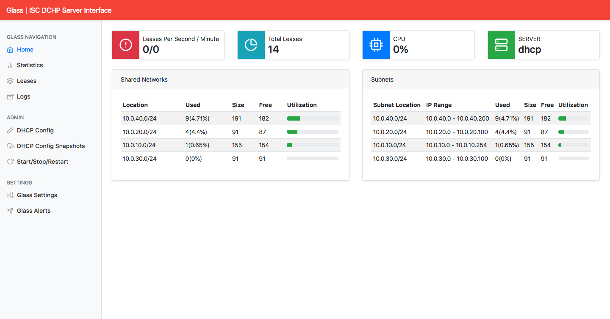
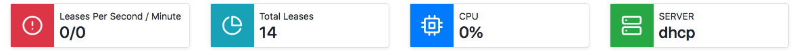
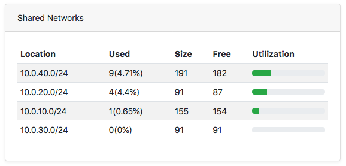
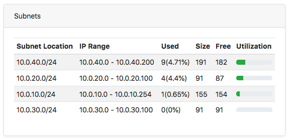

# Glass ISC DHCP

## DESCRIÇÃO
---

O projeto *open source* [Akkadius/glass-isc-dhcp](https://github.com/Akkadius/glass-isc-dhcp) que administra o serviço Glass ISC DHCP, disponibilizou um projeto HTML e CSS no arquivo [code.zip](code.zip), contudo, o sistema deve gerar a interface semelhante ao da *Figura 1* usando dados JSON na pasta `data/` por meio da linguagem Javascript.

*Figura 1 - Proposta de Template*


Portanto, cabe a você continuar o desenvolvimento através dos componentes que serão levantadas a seguir, detalhe, no total será exigido a entrega de no mínimo dois componentes, sendo que o primeiro é obrigatório.

## COMPONENTES
---

**COMPONENTE 1 -** Crie o painel de `cards` no arquivo [`index.html`](index.html), especificamente em `TODO cards` mas considerando que:

* Os dados para geração do HTML estão no arquivo `data/cards.json`.
* O conteúdo de cada `card` deve seguir a estrutura HTML:

```html
<div class="col">
  <div class="card d-flex flex-row shadow-sm">
    <div class="prepend-icon bg-danger text-white p-3 d-flex align-items-center">
      <span data-feather="alert-circle"></span>
    </div>
    <div class="p-2">
      <p class="m-0">Leases Per Second / Minute</p>
      <h4 class="m-0">0/0</h2>
    </div>
  </div>
</div>
``` 

* O painel de `cards` deve apresentar a estrutura conforme a *Figura 2*.

*Figura 2 - Painel Top Stats*<br>



**COMPONENTE 2 -** Crie o conteúdo do Painel `Shared Networks` no arquivo [`index.html`](index.html), especificamente em `TODO Shared Networks` mas considerando que:

* Os dados para geração do HTML estão no arquivo `data/shared-networks.json`.
* O conteúdo de cada linha da tabela deve seguir a estrutura HTML:

```html
<tr>
  <td>10.0.40.0/24</td>
  <td>9(4.71%)</td>
  <td>191</td>
  <td>182</td>
  <td class="align-middle">
    <div class="progress" style="height: .6rem;">
      <div class="progress-bar bg-success" role="progressbar" style="width: 25%" aria-valuenow="25" aria-valuemin="0" aria-valuemax="100"></div>
    </div>
  </td>
</tr>
``` 

* O painel deve apresentar a disposição conforme a *Figura 3*.

*Figura 3 - Painel Development Activity*<br>



**COMPONENTE 3 -** Crie o conteúdo do Painel Subnets no arquivo [`index.html`](index.html), especificamente em `TODO networks` mas considerando que:

* Os dados para geração do HTML estão no arquivo `data/networks.json`.
* O conteúdo do painel deve seguir a estrutura HTML:

```html
<tr>
  <td>10.0.40.0/24</td>
  <td>10.0.40.0 - 10.0.40.200</td>
  <td>9(4.71%)</td>
  <td>191</td>
  <td>182</td>
  <td class="align-middle">
    <div class="progress" style="height: .6rem;">
      <div class="progress-bar bg-success" role="progressbar" style="width: 25%" aria-valuenow="25" aria-valuemin="0"
        aria-valuemax="100"></div>
    </div>
  </td>
</tr>
``` 

* O painel deve apresentar a disposição conforme a *Figura 4*.

*Figura 4 - Painel Networks*<br>



<br>
<br>
<br>

> [Alternativa de resposta](code-response/)