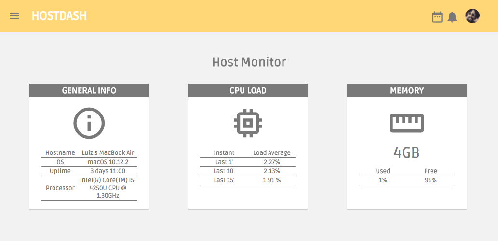
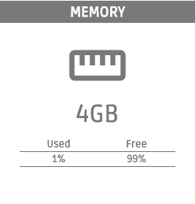

# Host Monitor

## DESCRIÇÃO
---

As questões da prova serão relacionadas ao layout da página Web da Figura 1, no qual os recursos necessários para a página serão disponibilizados através do arquivo [code.zip](https://github.com/ifpb/dw/blob/master/assessment/prova-js/code.zip).

*Figura 1 - Layout da página*

Resumidamente o layout é dividido em duas áreas principais, o cabeçalho e a área principal de conteúdo. Cada uma dessas áreas apresentam itens com aparências específicas, que devem ser preservados o mais próximo possível do comportamento  estrutural e do estilo apresentado na Figura 1.

Para facilitar nesse processo, cada questão abordará um item específico, no qual seu conteúdo será previamente disponibilizado por meio dos arquivos obtidos que já incluem o HTML e o CSS necessário. Por exemplo, uma das questões solicitará a criação e estilização do painel de informações do Host, e como ponto de partida, os arquivos obtidos já disponibilizam a estrutura e estilo da tabela do painel para que seja apenas preenchido com os dados necessários.

Para coletar tais informações será necessário fazer uso de um sistema que disponibiliza um serviço de coleta de dados do host através de uma API Web. Para realização da prova será considerado que os experimentos possuem o cenário da Figura 2, no qual qualquer computador pode acessar as rotas do servidor Monitor API.

*Figura 2 - Cenário de consumo do Monitor API Server*

Tal serviço pode ser bastante útil para atividades de monitoramento, e pode ser implementado através do projeto [monitor-api](https://github.com/lucachaves/monitor-api), que descreve as rotas disponível juntamente com o processo de instalação e execução do serviço.

Uma das rotas que serão úteis para essa prova será o `/v1/memory`, que através do método GET executa o comando que coletado no servidor Monitor API as porcentagens de uso da memória. Para saber mais detalhes sobre as outras rotas disponíveis basta acessar a rota `/v1`.

## QUESTÕES
---

**QUESTÃO 1 -** No Layout da Figura 1 é possível identificar que existe os paineis de informações do Host selecionado, apresentado através dos recortes das Figura 3 até a Figura 5. Todas as estruturas e estilos necessários para essa ilustração estão disponibilizadas. Então, através do Monitor API construa o:

**a.** Painel de informações do host conforme a Figura 3.

*Figura 3 - Painel de informações do host.*

**b.** Painel sobre a carga da CPU conforme a Figura 4.

*Figura 5 - Painel sobre a carga da memória.*

**c.** Painel sobre a carga da memória conforme a Figura 5.

*Figura 4 - Painel sobre a carga da CPU.*

> [Alternativa de Resposta](code-response/)

<!-- http://blacktie.co/2014/07/dashgum-free-dashboard/ -->
<!-- http://linuxdash.afaqtariq.com/#/system-status -->