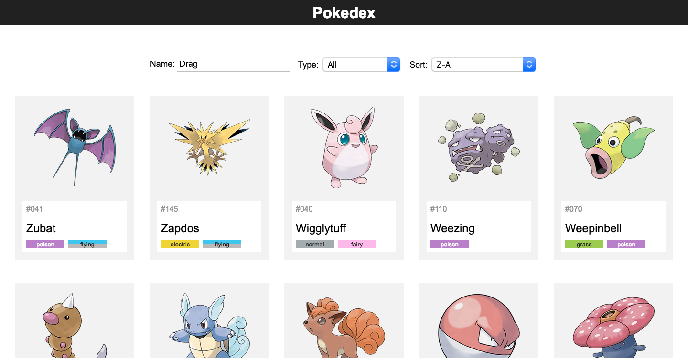
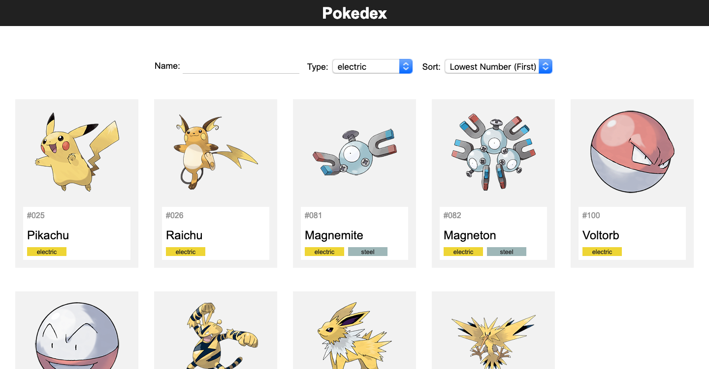
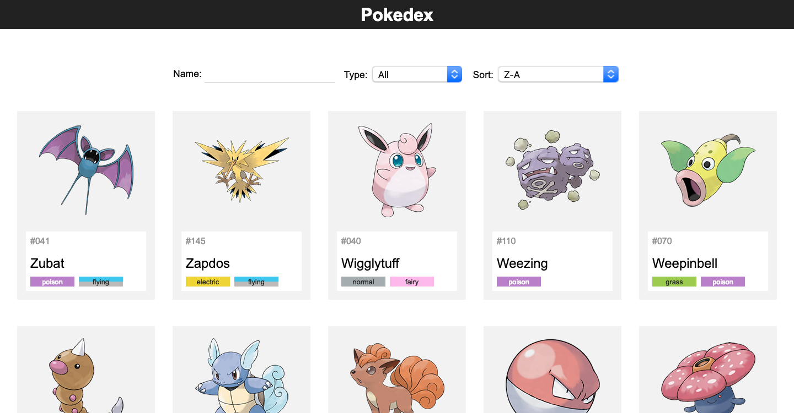
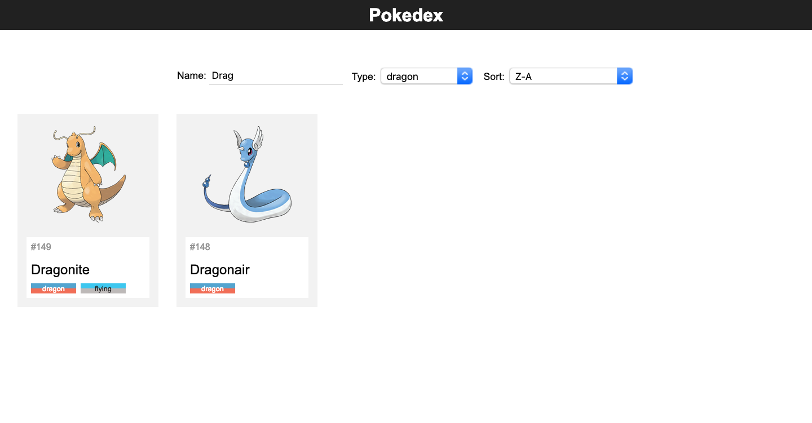

# Pokedex Challenge

## Descrição
---

Uma empresa de artigos Nerd está em busca de profissionais para criar um página Web sobre a Pokedex de Pokemons.

A princípio a empresa disponibilizou os dados dos Pokemons no arquivo [pokedex.json](code/data/pokedex.json) e pretende criar uma tela semelhante ao da Figura 1.

*Figura 1 - Layout da Página*


Detalhe, a empresa já disponibilizou uma estrutura inicial no arquivo [code.zip](code.zip), e a seguir será descrito alguns componentes para auxiliar a geração dinâmica da página usando as informações do arquivo JSON.

## Componentes
---

**COMPONENTE 1 -** No arquivo JSON existe um Array de Pokemons que possui várias informação como id, nome, tipo e estatísticas:

```js
[
  {
    "id": 1,
    "name": "Bulbasaur",
    "type": [
      "grass",
      "poison"
    ],
    "stats": {
      "total": 318,
      "hp": 45,
      "attack": 49,
      "defense": 49,
      "sp-atk": 65,
      "sp-def": 65,
      "speed": 45
    }
  },
  ...
]
```

Usando esses dados crie a Pokedex seguindo o padrão da *Figura 2*.

*Figura 2 - Pokedex*<br>


Também considere que o HTML necessário para compor esta Pokedex deve possuir uma estrutura como esta para o Pokemon Bulbasaur:

```html
<div class="pokemon" data-name="Bulbasaur" data-type="grass,poison" tabindex="1">
  <figure class="pokemon-figure">
    
  </figure>
  <section class="pokemon-description">
    <span class="pokemon-id">#001</span>
    <h1 class="pokemon-name">Bulbasaur</h1>
    <div class="pokemon-types">
      <span class="pokemon-type background-grass">grass</span>
      <span class="pokemon-type background-poison">poison</span>
    </div>
  </section>
  <section class="pokemon-stats">
    <div class="stat-row">
      <div>hp</div>
      <div class="stat-bar">
        <div class="stat-bar-bg" style="width: 18%">45</div>
      </div>
    </div>
    <div class="stat-row">
      <div>attack</div>
      <div class="stat-bar">
        <div class="stat-bar-bg" style="width: 19.6%">49</div>
      </div>
    </div>
    <div class="stat-row">
      <div>defense</div>
      <div class="stat-bar">
        <div class="stat-bar-bg" style="width: 19.6%">49</div>
      </div>
    </div>
    <div class="stat-row">
      <div>sp-atk</div>
      <div class="stat-bar">
        <div class="stat-bar-bg" style="width: 26%">65</div>
      </div>
    </div>
    <div class="stat-row">
      <div>sp-def</div>
      <div class="stat-bar">
        <div class="stat-bar-bg" style="width: 26%">65</div>
      </div>
    </div>
    <div class="stat-row">
      <div>speed</div>
      <div class="stat-bar">
        <div class="stat-bar-bg" style="width: 18%">45</div>
      </div>
    </div>
  </section>
</div>
```

**COMPONENTE 2 -** Crie o filtro da Pokedex por nome para exibir os pokemon da Pokedex que possuirem o termo digitado em seu nome, caso contrário ele não será exibido. A Figura 3, por exemplo, lista na Pokedex os pokemons que possuem o nome `pikachu`.

<!-- TODO 0 pokemons -->
*Figura 3 - Filtro por nome*<br>


**COMPONENTE 3 -** Crie o filtro da Pokedex por tipo para exibir apenas os pokemon de algum tipo específico. A Figura 4, por exemplo, lista na Pokedex apenas os pokemons que possuem o tipo `eletric`.

*Figura 4 - Filtro por tipo*<br>


**COMPONENTE 4 -** Crie o ordenador da Pokedex para ajudar na listagem da Pokedex conforme a Figura 5.

*Figura 5 - Ordenador da Pokedex*<br>


**COMPONENTE 5 -** Faça que o formulário realize o filtro e ordenação de modo integrado, tal como a Figura 6.

*Figura 6 - Ordenador e Filtros combinados*<br>


<br>
<br>
<br>

> [Alternativa de resposta](code-response/)
