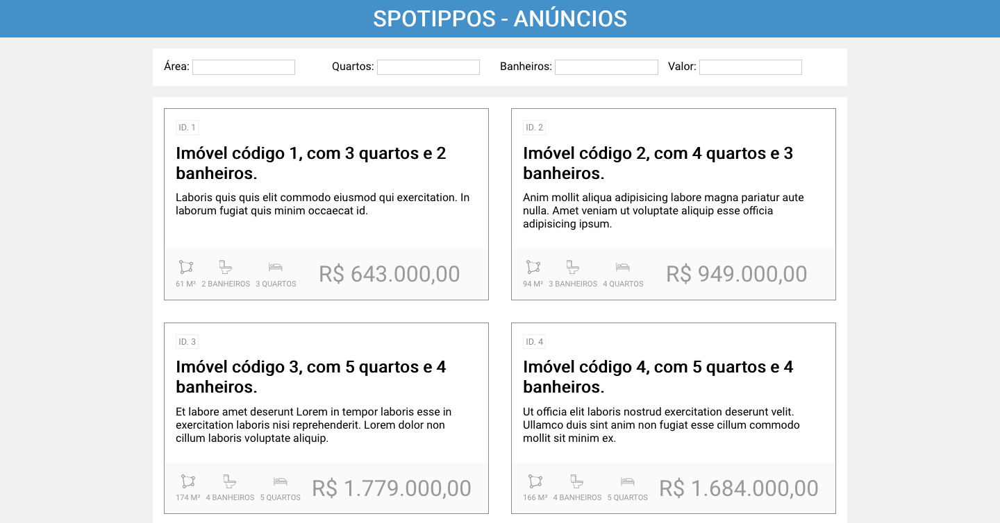
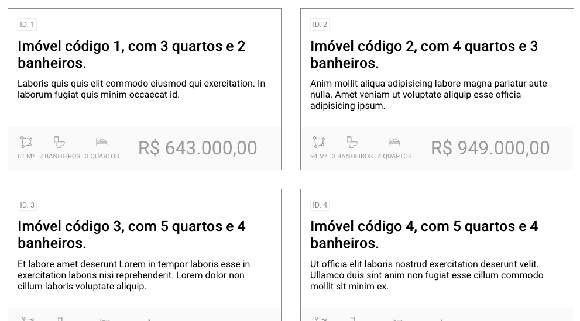
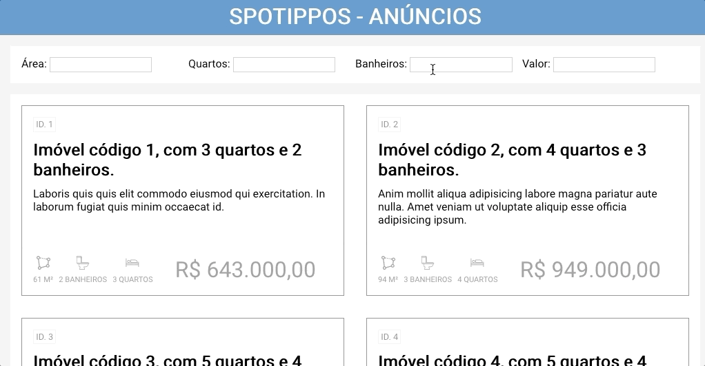

# Grupozap Challenge

## Descrição
---

A empresa [Grupozap](https://www.grupozap.com) está em busca de um profissional Front-end, para isto ela criou o [grupozap/code-challenge](https://github.com/grupozap/code-challenge/blob/master/frontend.md) que pretente criar um catálogo de anúncios de imóveis.

Para ajudar a inicialização do desafio foi definido uma proposta de layout estático disponível no arquivo [site.zip](site.zip) e ilustrado na Figura 1.

*Figura 1 - Layout da Página*


A seguir será descrito alguns componentes para auxiliar a geração dinâmica da página usando as informações da `const imoveis` disponível em `js/imoveis.js`.

## Componentes
---

**COMPONENTE 1 -** No arquivo `js/imoveis.js` existe um Array de anúncios que possui várias informações como título, drescrição, preço, área, número de quarto e banheiros:

```js
{
  "id": 1,
  "title": "Imóvel código 1, com 3 quartos e 2 banheiros.",
  "price": 643000,
  "description": "Laboris quis quis elit commodo eiusmod qui exercitation. In laborum fugiat quis minim occaecat id.",
  "lat": 1257,
  "long": 928,
  "beds": 3,
  "baths": 2,
  "squareMeters": 61
}
```

Usando esses dados crie uma lista de imóveis conforme ilustra a *Figura 2*.

*Figura 2 - Lista de imóveis*<br>


Também considere que o HTML necessário para compor este grid de imóveis deve ser este:

```html
<div class="imovel">
  <div class="resumo">
    <span class="id">ID. 1</span>
    <h2 class="title">Imóvel código 1, com 3 quartos e 2 banheiros.</h2>
    <div class="description">Laboris quis quis elit commodo eiusmod qui exercitation. In laborum fugiat quis minim occaecat id.</div>
  </div>
  <div class="info">
    <div class="infoItem squareMeter">
      
      <div class="value">61 M²</div>
    </div>
    <div class="infoItem bath">
      
      <div class="value">2 BANHEIROS</div>
    </div>
    <div class="infoItem bed">
      
      <div class="value">3 QUARTOS</div>
    </div>
    <div class="price">R$ 643.000,00</div>
  </div>
</div>
```

**Dica**, para exibir o preço do imóvel no formato brasileiro, use o seguinte código:

```js
const price = 643000
console.log(price.toLocaleString('pt-BR', { minimumFractionDigits: 2 }))
//=> 643.000,00
```

**COMPONENTE 2 -** Pensando em facilitar apenas a listagem dos imóveis que possuiam alguns parâmetros iniciais, o layout possui um seção de filtro. A idéia é que ao mudar os campos, a listagem seja atualizada conforme os valores digitados. A *Figura 3* ilustra bem como seria a ação do filtro.

*Figura 3 - Filro dos imóveis*<br>


**Observação:** veja que o filtro considera valores maiores ou igual ao informado.

<br>
<br>

> Alternativa de resposta: [recriando elemento](site-response/) e [ocultando por estilo](site-response-style/).