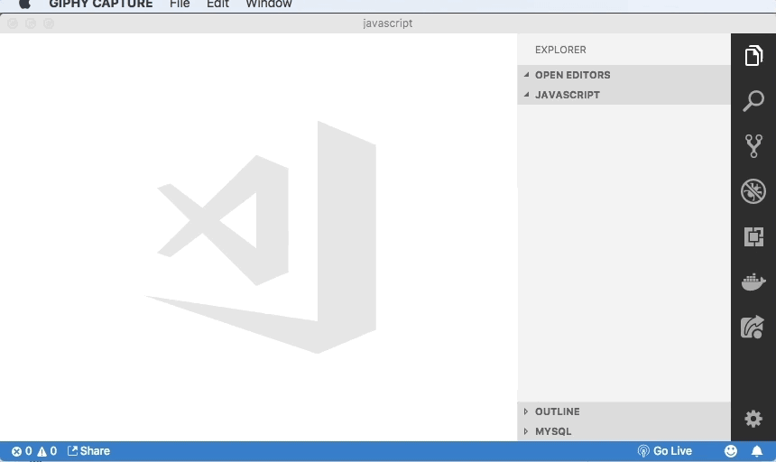
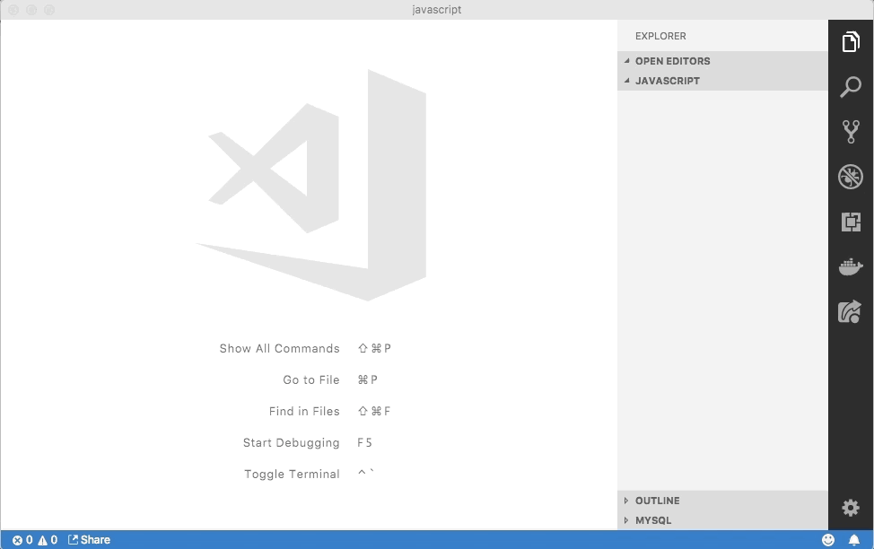

# How to run javascript

* [Node.js (terminal)](#node.js-terminal)
* [Visual Studio Code](#visual-studio-code)
* [Browser Console](#browser-console)
* [Online Interpreter](#online-interpreter)
* [Unit Test (Jest)](#unit-test-jest)

## Node.js (terminal)
---

### Installing Node

Installing Node by [nvm](https://github.com/creationix/nvm):
```
$ wget -qO- https://raw.githubusercontent.com/creationix/nvm/v0.33.11/install.sh | bash
```

Node LTS:
```
$ nvm install lts
$ nvm alias default lts
```

Node Stable:
```
$ nvm install stable
$ nvm alias default stable
```

Alternatives:
- [Node.js - Download](https://nodejs.org/en/)
- [Chocoletey](https://chocolatey.org)

```
$ choco install nodejs
```

### Running JS

Running by file:

```
$ node file.js
```



Node Prompt:
```
$ node
> (ctrl + v file)
```

Running by file (ECMAScript Modules ESM):
```
$ git clone https://github.com/ifpb/javascript-exercises/
$ cd javascript-exercises/ecma/function/sum/code/
$ mv sum.{js,mjs)
$ node --experimental-modules sum.print.mjs
```

## Visual Studio Code
---

Installing:
- [Visual Studio Code](https://code.visualstudio.com/)
- [Code Runner](https://marketplace.visualstudio.com/items?itemName=formulahendry.code-runner)
- Node.js

<!-- (run, debug, jest, chrome) -->



## Browser Console
---

```
Control+Shift+J (Google Chrome)
> (ctrl + v file)
```

## Online Interpreter
---

[https://repl.it/](https://repl.it/)
```
Open [https://repl.it/](https://repl.it/)
> Choose language: Javascript
> (ctrl + v file)
> Click button run
```

## Unit Test (Jest)
---

Installing Jest (package.json):
```
$ git clone https://github.com/ifpb/javascript-exercises/
$ cd javascript-exercises/ecma/
$ ls package.json
package.json
$ npm install
```

Rename file extension to `.js`:
```
$ mv function/sum/code/sum.{mjs,js}
```

Running Tests and Viewing Results (test fail):
```
$ npx jest function/sum/code/sum.test.js
 FAIL  function/sum/code/sum.test.js
  Number Tools
    ✕ adding 1 + 2 (12ms)
    ○ skipped 1 test

  ● Number Tools › adding 1 + 2

    expect(received).toBe(expected) // Object.is equality

    Expected value to be:
      3
    Received:
      undefined

    Difference:

      Comparing two different types of values. Expected number but received undefined.

      4 |
      5 |   test('adding 1 + 2', () => {
    > 6 |     expect(sum(1, 2)).toBe(3)
      7 |   })
      8 |
      9 |   test.skip('adding 3 + 2', () => {

      at Object.<anonymous> (function/sum/code/sum.test.js:6:23)

Test Suites: 1 failed, 1 total
Tests:       1 failed, 1 skipped, 2 total
Snapshots:   0 total
Time:        2.689s
Ran all test suites matching /code\/function\/sum.test.js/i.
```

Running Tests and Viewing Results (test passed):
```
$ npx jest function/sum/code/sum.test.js
 PASS  response/function/sum.test.js
  Number Tools
    ✓ adding 1 + 2 (5ms)
    ✓ adding 3 + 2

Test Suites: 1 passed, 1 total
Tests:       2 passed, 2 total
Snapshots:   0 total
Time:        1.594s
Ran all test suites matching /response\/function\/sum.test.js/i.
```
