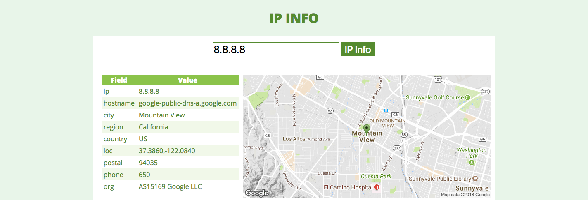

# Ipinfo API

## Description
---

API: [Ipinfo API](https://ipinfo.io/developers), [Static Map Maker](https://staticmapmaker.com), [Static Google Map API](https://developers.google.com/maps/documentation/static-maps/)

## Interface
---

Code: [code.zip](code.gif)

> [Alternativa de resposta](code-response/)